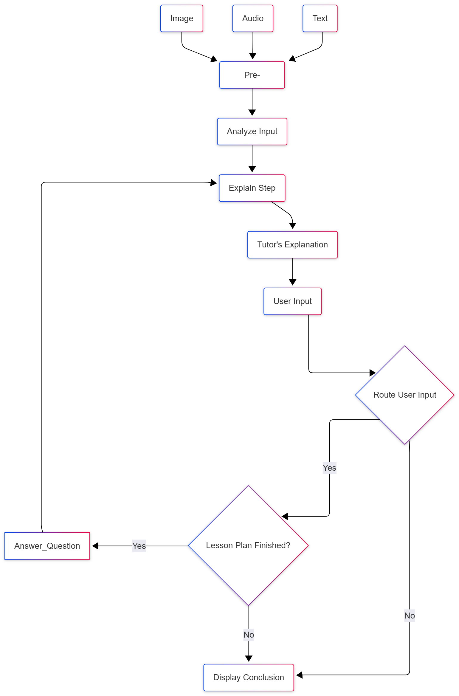

# Multimodal Educational Tutor

This project is a fully functional proof-of-concept for a conversational, multimodal tutor. Built with a modern AI stack including LangGraph, Streamlit, and various vision/speech models, this application can accept textbook pages, diagrams, or audio recordings to generate and deliver interactive, step-by-step lessons.

The core experimental angle of this project is a **context-adaptive education system**, where the tutor's teaching plan and responses are dynamically shaped by the user's input and the ongoing conversation.

## Key Features

*   **Multimodal Input**: Accepts image files (`.png`, `.jpg`), audio files (`.mp3`, `.wav`), and plain text as the basis for a lesson.
*   **Automated Curriculum Generation**: Upon receiving input, the system analyzes the content to identify a core topic and automatically generates a logical, step-by-step teaching plan.
*   **Interactive Step-by-Step Teaching**: The tutor guides the user through the generated curriculum one concept at a time, waiting for the user's cue to proceed.
*   **Context-Aware Q&A**: Users can interrupt the lesson at any point to ask specific questions. The tutor will answer them using the context of the original document and the conversation history before offering to continue the lesson.
*   **Stateful Memory**: Powered by LangGraph, the tutor maintains a coherent state throughout the conversation, remembering the topic, the lesson plan, and what has already been covered.

## Tech Stack

*   **Orchestration**: [LangGraph](https://github.com/langchain-ai/langgraph) - Manages the state and flow of the conversation, acting as the application's "brain."
*   **Frontend**: [Streamlit](https://streamlit.io/) - Provides a simple and interactive web interface for chat and file uploads.
*   **Language Model**: [LangChain](https://www.langchain.com/) with OpenAI `gpt-4-turbo` - Powers the core reasoning, explanation, and curriculum generation.
*   **Vision Model**: [Hugging Face Transformers](https://huggingface.co/transformers) with Salesforce BLIP - Generates text descriptions of images and diagrams.
*   **OCR (Optical Character Recognition)**: [EasyOCR](https://github.com/JaidedAI/EasyOCR) - Extracts printed text from images.
*   **Speech Recognition**: [SpeechRecognition](https://pypi.org/project/SpeechRecognition/) - Transcribes spoken questions from audio files into text.

## Setup and Installation

Follow these steps to get the tutor running on your local machine.

```
### 1. Clone the Repository

```bash
git clone https://github.com/Viswa-Prakash/Multimodal_Educational_Tutor_Chatbot.git
cd Multimodal_Educational_Tutor_Chatbot

### 2. Create a Virtual Environment

conda create -p chatbot python=3.12 -y
conda activate chatbot

### 3. Install Dependencies

pip install -r requirements.txt

### 4. Set Up Environment Variables

Create a `.env` file in the root directory and add your API keys for OpenAI

### 5. Run the Tutor

Run the following command to start the tutor:

```bash
streamlit run app.py
```

---
## **Application Flowchart**

